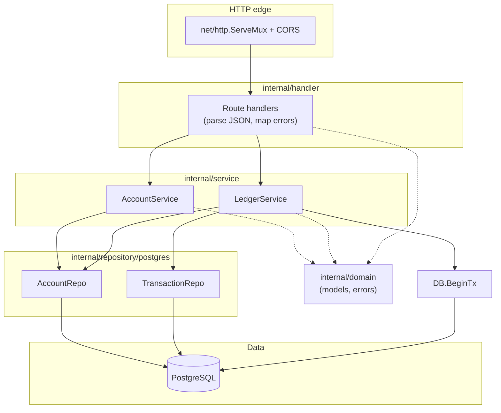
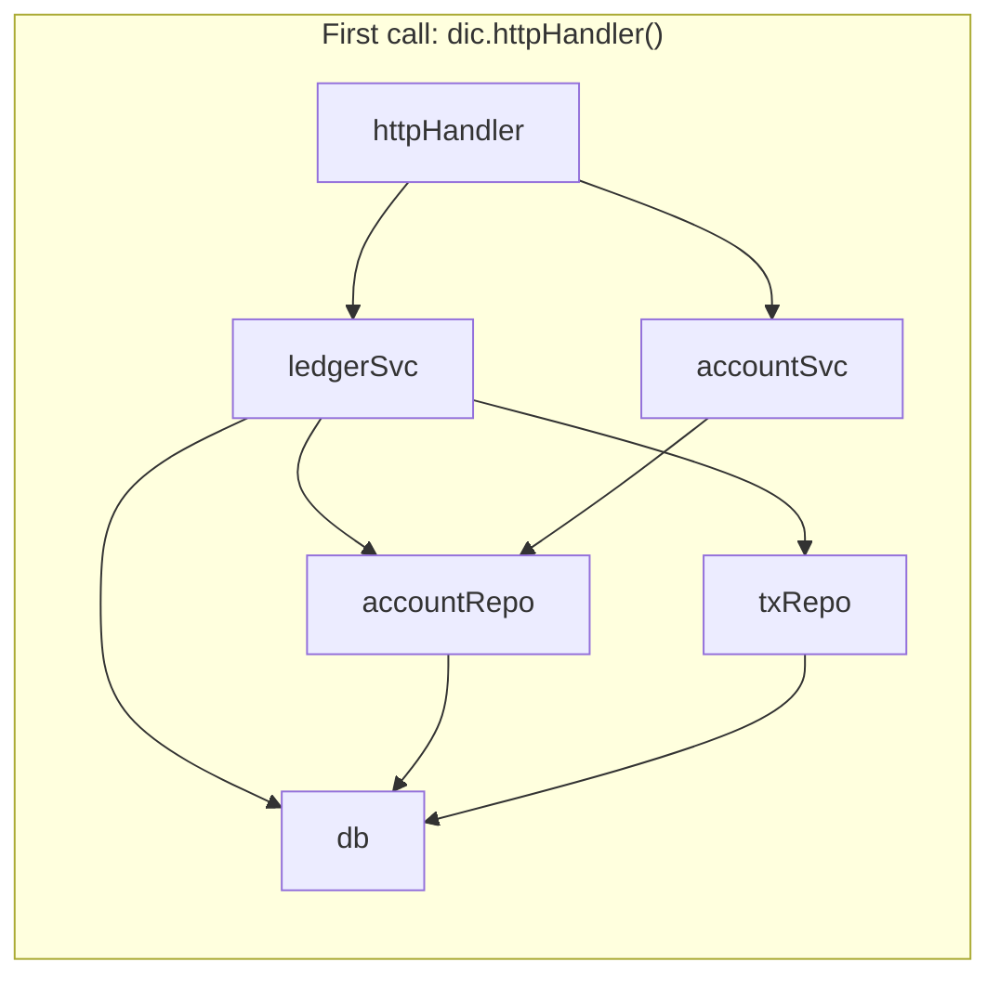
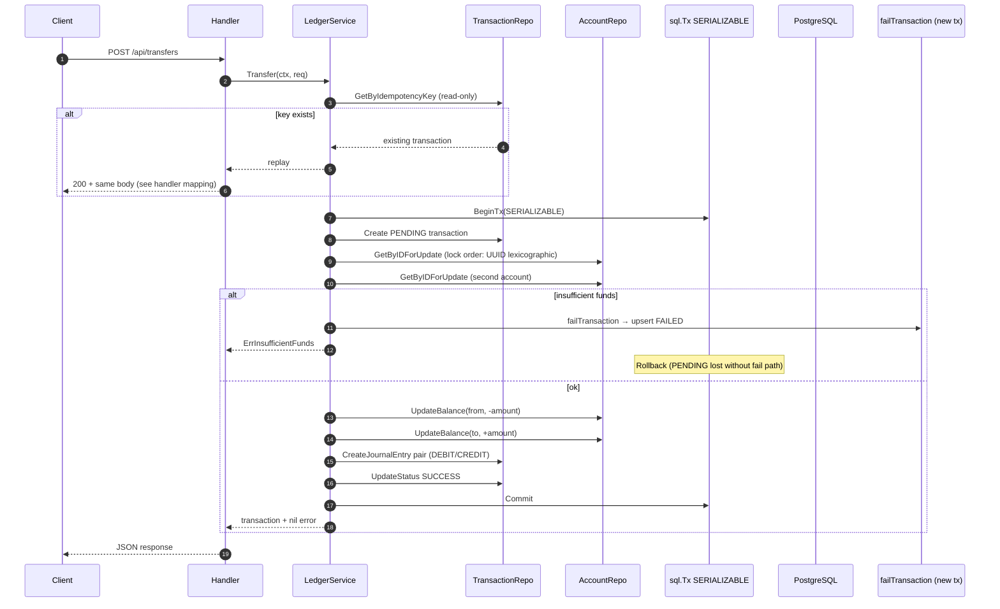
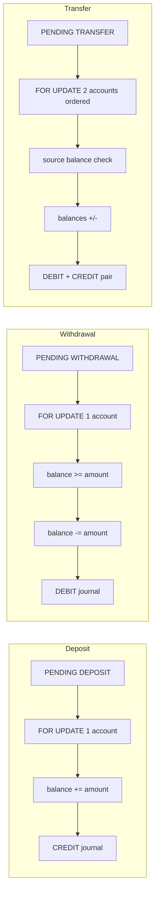
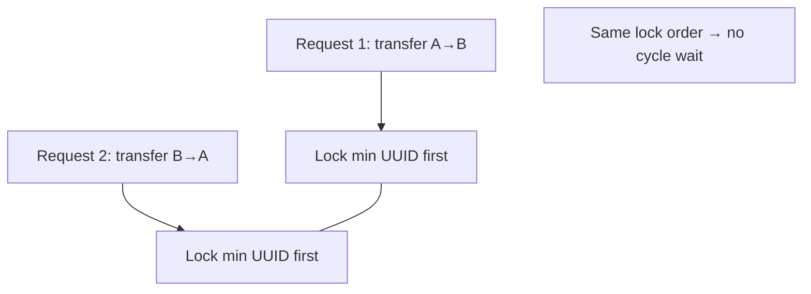

# Code Flow Guide

This document explains **how control and data move through the banking-system codebase** from process start through HTTP requests into PostgreSQL. It complements [README.md](./README.md), which covers setup, API contracts, and design trade-offs in depth.


## 1. Layered architecture

The application uses a strict **top-down dependency rule**: each layer only talks to the layer directly below it. Wiring happens in `cmd/server` at startup, not inside domain or repository packages.



**Read path (example: `GET /api/accounts`)**: `Handler` → `AccountService` → `AccountRepository` → SQL.

**Write path (example: `POST /api/transfers`)**: `Handler` → `LedgerService` → begins a DB transaction → locks rows via `AccountRepository`, persists via `TransactionRepository`, updates balances and journal entries in the same SQL transaction.

---

## 2. Composition root and lazy DI

All concrete implementations are constructed in `cmd/server`. The DI container uses **lazy providers**: the first time something needs `httpHandler`, the chain resolves `accountSvc`, `ledgerSvc`, repos, and finally opens the database (applies embedded schema, seeds demo data).



After the first resolution, the same mutex-protected closures return **cached singletons** (see README “Dependency Injection”).

---

## 3. Process lifecycle: from `main` to listening server

```mermaid
sequenceDiagram
    participant Main as main()
    participant Run as run()
    participant DIC as newDIContainer
    participant HH as httpHandler provider
    participant DB as postgres.Open + schema
    participant Srv as serve()

    Main->>Run: run()
    Run->>Run: getFlags()
    Run->>DIC: newDIContainer(flg)
    Note over DIC: register providers only; no DB yet
    Run->>HH: dic.httpHandler()
    HH->>DB: cascade: first db() opens pool, runs migrations
    HH-->>Run: http.Handler
    Run->>Srv: serve(addr, h)
    Srv->>Srv: ListenAndServe (goroutine)
    Srv->>Srv: block on SIGINT/SIGTERM
    Srv->>Srv: Shutdown(10s)
    Note over Run: defer closeDIC closes DB pool
```

---

## 4. HTTP request flow (conceptual)

Every request hits the mux, then a handler method that decodes input, calls a service, and writes JSON or an error. Domain errors are translated to status codes in the handler.

```mermaid
flowchart TD
    A[Client HTTP request] --> B[ServeMux matches path]
    B --> C{Method + path}
    C -->|GET /api/accounts| D[ListAccounts]
    C -->|POST /api/transfers| E[handleTransfer]
    C -->|...| F[other handlers]

    E --> G[Decode JSON → domain request DTO]
    G --> H{Parse OK?}
    H -->|no| I[400 Bad Request]
    H -->|yes| J[ledger.Transfer(ctx, req)]

    J --> K{Domain error?}
    K -->|yes| L[Map to 404 / 422 / 500 / 200 idempotent replay]
    K -->|no| M[201 + transaction JSON]
```

---

## 5. Ledger mutation flow: transfer (deepest path)

`LedgerService.Transfer` is the most involved path: idempotency (before the serializable tx), then `SERIALIZABLE` transaction, ordered row locks, balance updates, journal pair, commit—or `failTransaction` on a **separate** connection if the business rule fails after a `PENDING` row was written.



**Why `failTransaction` exists**: the main transaction rolls back on failure, which would remove the `PENDING` row. A second connection commits a `FAILED` (or upserts by id) so every attempt stays in the audit log. See README “Failure Auditing”.

---

## 6. Simpler ledger operations (structure)

Deposit, withdrawal, and reversal follow the same **skeleton**: validate → optional idempotency → `BeginTx(SERIALIZABLE)` → create `PENDING` → lock account(s) → apply balances and journal entries → `SUCCESS` / `failTransaction`. Reversal branches on `original.Type` (transfer vs deposit vs withdrawal) before writing the inverse journal entries.



---

## 7. Concurrency: how parallel requests are serialized safely

Three ideas work together (details in README):

| Mechanism | Where | Effect |
|-----------|--------|--------|
| `SERIALIZABLE` | `BeginTx` in `LedgerService` | PostgreSQL detects anomalies; one tx may retry/abort |
| `SELECT FOR UPDATE` | `GetByIDForUpdate` | Exclusive row lock on touched accounts |
| Lock order | Transfer: sort two UUIDs lexicographically | Avoids deadlock for A→B and B→A at once |



---

## 8. ASCII overview (no Mermaid renderer)

If your viewer does not render Mermaid diagrams, use this mental model:

```
                    ┌─────────────────────────────────────┐
                    │           cmd/server/main            │
                    │  run() → DI → httpHandler → serve()  │
                    └──────────────────┬──────────────────┘
                                       │
                    ┌──────────────────▼──────────────────┐
                    │     internal/handler (HTTP + JSON)    │
                    └──────────────────┬──────────────────┘
                         ┌────────────┴────────────┐
                         ▼                         ▼
              ┌──────────────────┐      ┌──────────────────┐
              │ AccountService   │      │ LedgerService    │
              └────────┬─────────┘      └────────┬─────────┘
                       │                         │
                       └────────────┬────────────┘
                                    ▼
                    ┌───────────────────────────────┐
                    │ postgres: AccountRepo,        │
                    │           TransactionRepo,    │
                    │           *sql.DB BeginTx     │
                    └───────────────────────────────┘
                                    │
                                    ▼
                              [ PostgreSQL ]
```

---

## 9. Where to read the code

| Concern | Primary files |
|---------|-----------------|
| Entry + shutdown | `cmd/server/main.go` |
| DI wiring | `cmd/server/di.go`, `cmd/server/*_repo.go`, `*_svc.go`, `http_handler.go` |
| Routes + error mapping | `internal/handler/handler.go` |
| Business rules + transactions | `internal/service/ledger.go`, `internal/service/account.go` |
| SQL + locking | `internal/repository/postgres/account.go`, `transaction.go` |
| Types + sentinel errors | `internal/domain/models.go`, `errors.go` |

For API shapes, error codes, and schema details, stay with [README.md](./README.md).


